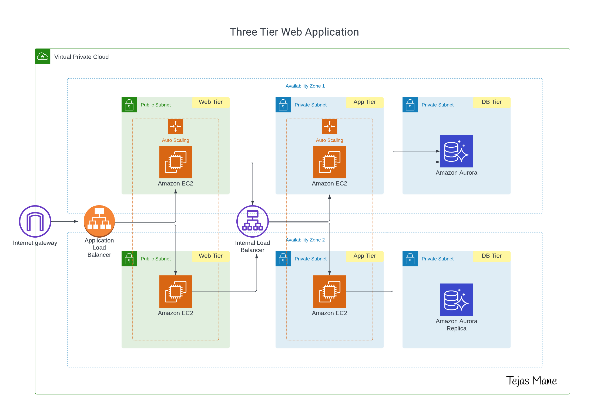
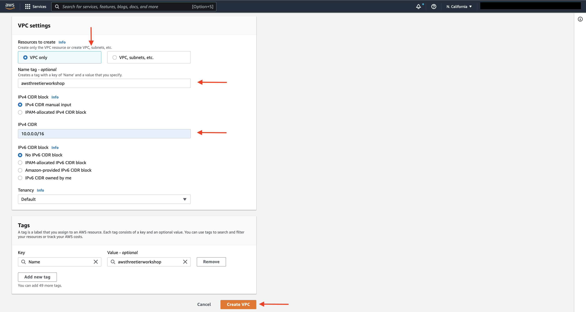
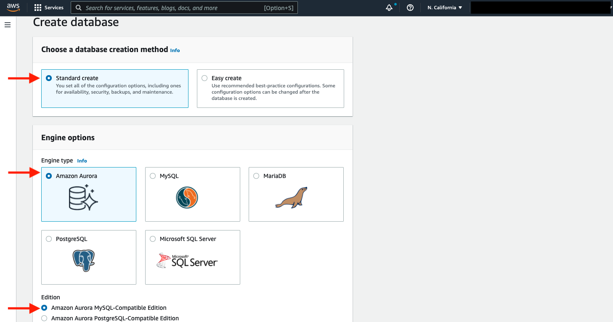
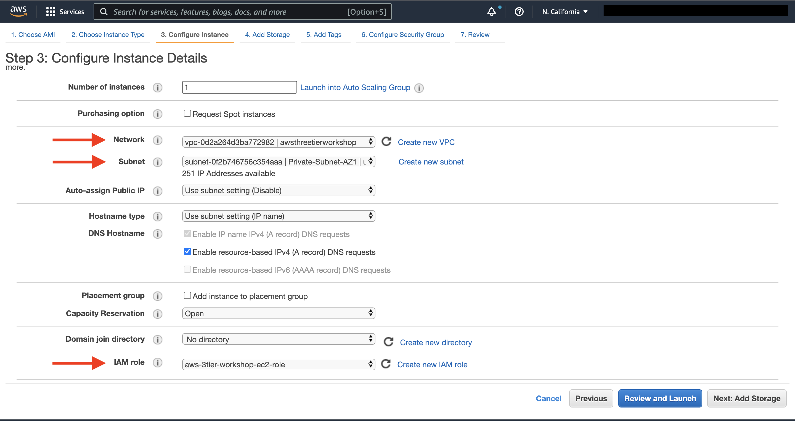
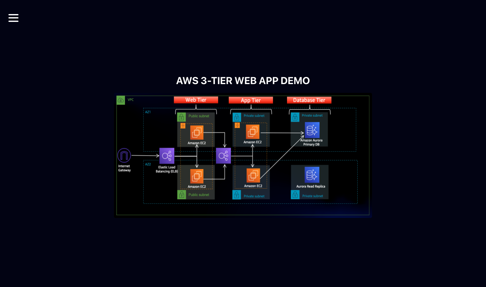
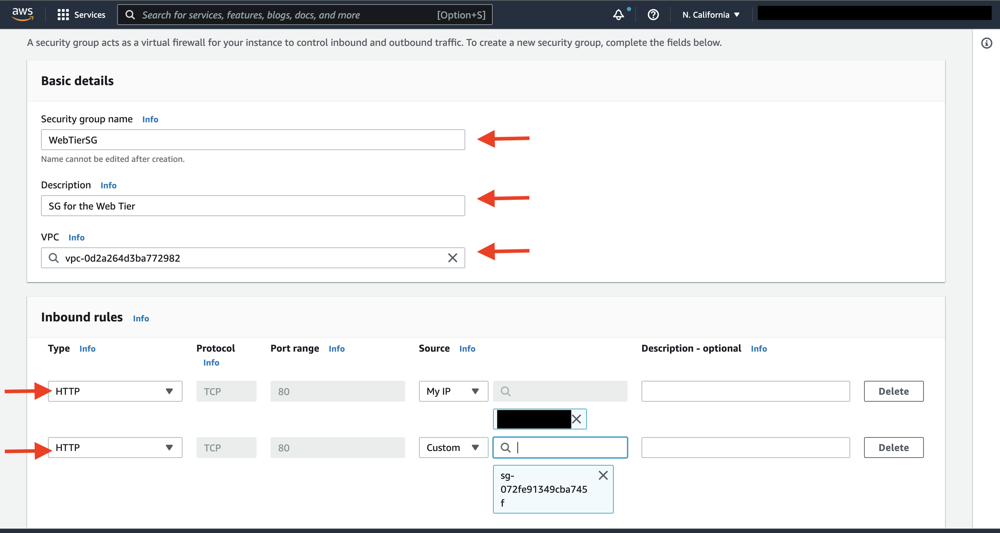

# <u>🚀 AWS Three-Tier Web Architecture</u>

---

## <u>📘 Description</u>

This project is a **hands-on walkthrough** of a three-tier web architecture in AWS.  
We will be creating the necessary **network**, **security**, **application**, and **database components** to run this architecture in an **available** and **scalable** manner.

The project includes both:
- 🔧 Manual setup instructions using the AWS Console
- 🛠️ Infrastructure as Code (IaC) using tools like Terraform or CloudFormation

---

## <u>🎯 Audience</u>

This demo is intended for learners with technical roles, especially **Scaler Learners** aiming to understand **AWS architecture patterns**.

> ✅ **Expected Knowledge:**  
> You should have a basic understanding of the following AWS services:
> - VPC  
> - EC2  
> - RDS  
> - S3  
> - ELB  
> - IAM  
> - AWS Console navigation

---

## <u>🔧 Pre-requisites</u>

Before getting started, ensure you have the following:

- ✅ An [AWS account](https://aws.amazon.com/free/)
- ✅ An IDE or text editor of your choice (e.g., VS Code)
- ✅ Basic knowledge of:
  - Web applications
  - Databases
  - Cloud and networking fundamentals

---

## <u>🗂️ Architecture Overview</u>

Expected layout:
- **Tier 1 (Presentation Layer):** Load Balancer (e.g., ALB/ELB)
- **Tier 2 (Application Layer):** EC2 instances running Dockerized microservice
- **Tier 3 (Data Layer):** RDS (MySQL/PostgreSQL)
---

## 🏗️ Architecture Flow

In this architecture:  
- A **public-facing Application Load Balancer (ALB)** forwards client traffic to web-tier EC2 instances.  
- The **web tier** runs Nginx web servers serving a React.js frontend and routing API calls to the internal load balancer.  
- The **internal ALB** directs requests to the **application tier** (Node.js), which processes data.  
- The **application tier** interacts with an **Aurora MySQL Multi-AZ database** for storage and retrieval.  
- **Load balancing, health checks, and auto-scaling groups** are configured at each layer to maintain availability and scalability.  

## ⚙️ Implementation Options

This project supports multiple implementation approaches:

1. **Manual Setup**  
   Follow the step-by-step instructions in the walkthrough to manually create and configure all AWS resources.

2. **Infrastructure as Code (IaC)**  
   Use the CloudFormation templates in the `/cloudformation` directory to automate deployment.

3. **AWS CLI Deployment**  
   Use the AWS CLI commands provided in the **AWS CLI Deployment Guide** for a scripted setup.

---

## 🧩 Key Components

### 🔹 Network Layer
- **VPC** with public and private subnets across two Availability Zones  
- **Internet Gateway** for public internet access  
- **NAT Gateways** for private subnet internet access  
- **Route Tables & Security Groups** for isolation and security  

---

## 🗂️ Architecture Components

### 🗄️ Database Layer
- **Aurora MySQL Cluster** with Multi-AZ deployment  
- **Private Subnet Placement** for enhanced security  
- **Database Subnet Group** for proper subnet association
  
  
---

### ⚙️ Application Layer
- **Node.js application** running on EC2 instances  
- **Auto Scaling Group (ASG)** for high availability and scalability  
- **Internal Application Load Balancer (ALB)** for traffic distribution  
- **Aurora MySQL integration** for persistent data storage

 
---

### 🌐 Web Layer
- **Nginx web server** serving a React.js frontend  
- **Auto Scaling Group (ASG)** for high availability and scalability  
- **Public Application Load Balancer (ALB)** for internet-facing traffic  
- **API proxying** to the application tier  

---

## 🔒 Security Enhancements
The project includes several security best practices:

- **Secure Credential Management:** AWS Secrets Manager for database credentials  
- **Network Isolation:** Proper subnet configuration & security groups  
- **SQL Injection Prevention:** Parameterized queries in application code  
- **Least Privilege Access:** IAM roles with minimal required permissions  
- **HTTPS Support:** SSL/TLS enabled for secure communication

 
---

## 🚀 Modernization Options
This project can be extended with modern AWS services:

- **Containerization:** Deploy using Amazon ECS or EKS  
- **Serverless:** Migrate the application tier to AWS Lambda & API Gateway  
- **CI/CD Automation:** Implement pipelines with AWS CodePipeline  
- **Monitoring & Observability:** Integrate with CloudWatch & X-Ray  
- **Edge Optimization:** Use CloudFront for global content delivery  

---

